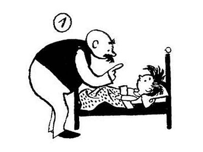

= Der Wortesammler - Mit Wortformen spielen: Vater und Sohn
01. Zu Bett gehen
v1.0, 10.10.2016
:doctype: book
// Settings:
:experimental:
:reproducible:
:icons: font
:listing-caption: Listing
:sectnums:
ifdef::backend-pdf[]
:title-logo-image: 
endif::[]

:imagesdir: images

[role="chapter-start"]

image::01_zubett_01.jpg[]
Vater bringt Sohn ins Bett. 
Er sagt: "Mach schön die Augen zu! Schlaf ein! Gute Nacht!"

image::01_zubett_02.jpg[]
Vater will leise davongehen. 
Sohn springt auf und schreit: 
"Papa, Papa, ich bin noch gar nicht müde!"
    
image::01_zubett_03.jpg[]
Papa spielt mit Sohn ein bisschen "Schubkarre". 
Er hält ihn an den Füßen fest 
und Sohn läuft auf den Händen.

image::01_zubett_04.jpg[]
Dann bringt Vater Sohn wieder ins Bett. 
Er sagt: "Jetzt aber schön schlafen! 
Mach die Augen zu! Gute Nacht!"

image::01_zubett_05.jpg[]
Vater will sich leise davonschleichen. 
Aber Sohn winkt mit dem Kopfkissen und jammert: 
Bitte, bitte, Papa, ich kann nicht schlafen. 
Ich bin noch gar nicht müde!

image::01_zubett_06.jpg[]
Da legt sich Vater auf den Rücken und 
streckt die Beine nach oben. 
Sohn setzt sich auf Vaters Füße, 
und sie spielen "Auf dem Pferd reiten"

image::01_zubett_07.jpg[]
Dann muss Sohn aber wieder ins Bett. 
Vater mahnt: "Jetzt aber schön schlafen, Sohnemann." 
Sei brav und schlaf! Gute Nacht!

image::01_zubett_08.jpg[]
Aber Sohn legt die Arme um Vaters Hals. 
Er klammert sich fest und weint: 
"Papa, Papa, bitte nicht weggehen. Ich kann nicht einschlafen, 
wenn ich alleine bin."

image::01_zubett_09.jpg[]
Da legt Vater sich zu Sohn ins Bett. 
(Das Bett ist allerdings zu klein. 
Vater muss die Beine über das Fußteil hängen.) 
Vater schließt die Augen und schläft ein. 
Aber Sohns Augen sind immer noch offen.
